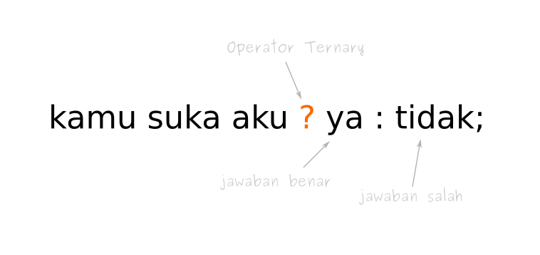

## SOAL (UAS) DASAR PEMROGRAMAN
---


1. Buatlah program yang menghasilkan output nilai `rata-rata dari tiga angka`. Nilai dari masing-masing tiga angka tersebut adalah `10, 20 dan 45.`

Tampilan Output yang diharapkan adalah,

```java
number 1 = 10
number 2 = 20
number 3 = 45
Rata-rata = 25
```

2. Diberikan tiga angka, tuliskan program yang menghasilkan output angka dengan nilai terbesar diantara tiga angka tersebut. Gunakan operator kondisi ?: yang telah dipelajari sebelumnya

`(PETUNJUK: gunakan dua set operator ?:` untuk memecahkan permasalahan ini)

Sebagai contoh, diberikan angka `10, 23 dan 5,`

Tampilan output yang diharapkan:

```Java
number 1 = 10
number 2 = 23
number 3 = 5
Nilai tertingginya adalah angka = 23
```

3. Dari flowcart dibawah ini:


✔︎ buatlah program untuk menghitung luas persegi panjang.

✔︎ buatlah program untuk konversi jam, menit, dan detik ke dalam total detik

4. Tulislah program dibawah ini dan simpanlah dengan nama tertentu. Lakukan kompilasi pada file tersebut dan amati hasilnya.Kenapa terjadi kegagalan pada saat kompilasi?. Benahilah kesalahan dibawah ini sehingga program tersebut dapat berjalan dengan baik.

```java
public class Test3 {
    public static void main(String args) {
        System.out.println("What's wrong with this program?");
    }
}
```

```java
public class Test4 {
    public void main(String[] args) {
        System.out.println("What's wrong with this program?");
    } 
}
```
5. Perhatikan gambar dibawah ini :



Buatlah program yang mendemonstrasikan gambar tersebut dengan menggunakan pemanfaatan `Percabangan IF/ELSE dengan Operator Ternary`